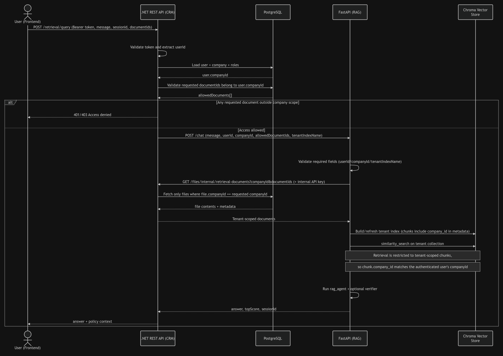

## Setup instructions for running the demo app locally

### 1. Prerequisites
- Docker Desktop
- .NET SDK 10
- Node.js 20+ and npm
- Python 3.11+ (3.12 recommended)

### 2. Clone and open the project
```bash
git clone <repo-url>
cd rag-assignment
```

### 3. Configure environment variables

Create a root `.env` file in the project root with your OpenAI key:
```env
OPENAI_API_KEY=openai_api_key_here
```

The CRM backend uses `crm/.env` for DB and API settings.
If it does not exist, create `crm/.env` with:
```env
API_PORT=8080
DB_HOST=localhost
DB_HOST_DOCKER=db
DB_PORT=5432
DB_NAME=crmdb
DB_USER=crmuser
DB_PASSWORD=crmpassword
```

### 4. Python virtual environment and packages
```bash
python3 -m venv .venv
source .venv/bin/activate
python -m pip install --upgrade pip
python -m pip install -r requirements.fastapi.txt
```

### 5. Install frontend packages
```bash
cd frontend
npm install
cd ..
```

### 6. Start services (four terminals)

Terminal A (Postgres in Docker):
```bash
cd crm
docker compose up
```

Terminal B (.NET CRM backend):
```bash
cd crm
dotnet run
```

Terminal C (FastAPI RAG API):
```bash
cd /path/to/rag-assignment
source .venv/bin/activate
python server-crm.py --host 127.0.0.1 --port 8000
```

Terminal D (React frontend):
```bash
cd frontend
npm run dev
```

### 6b. Run the RAG agent directly in console mode (no API)
If you want to run the RAG agent as a command-line app only, use `server.py` (not `server-crm.py`):
```bash
cd /path/to/rag-assignment
source .venv/bin/activate
python server.py
```

Use `server-crm.py` only for FastAPI mode.

### 7. Open the app
- Frontend: http://localhost:5173
- CRM API (Swagger): http://localhost:8080/swagger
- FastAPI health: http://127.0.0.1:8000/health

### 8. Seeded login users (when DB is empty)
On backend startup, if the database is empty, it auto-seeds these users:
- `daorsahyseni@gmail.com` in `Company A`
- `johndoe@gmail.com` in `Company B`
- Password for both: `P@ssword123`

### 9. Optional: run the evaluator
```bash
source .venv/bin/activate
python -m evals.run_eval
```

### 10. Troubleshooting
- If login fails unexpectedly, make sure CRM backend is running on `http://localhost:8080`.
- If chat fails, make sure FastAPI is running on `http://127.0.0.1:8000`.
- If DB connection fails, make sure `docker compose up` is running inside `crm/`.
- If Python import errors appear, re-activate `.venv` and re-run `pip install -r requirements.fastapi.txt`.

# Outline of my design decisions for improving the RAG system:

1-----------------------------------------------------------------------------------------------------
Query re-writting using domain phasing.
The reason behind using a second LLM call for rewritting user questions is done to improve 
retrieval by aligning user phasing with document wording so embedding search finds the right chunks.
This does not change what the user asked, it only improves the phasing so the LLM gets better context.
I tested cases with and without it and found the model gave better answers and refused less.

2-----------------------------------------------------------------------------------------------------
The normal threshold at 0.30 (SIMILARITY_THRESHOLD=0.30)
The second, softer threshold of 0.25 (SIMILARITY_THRESHOLD_TOP1=0.25)

How they work together:
- We retrieve the top K scored chunks normally
- We keep all chunks with score >= 0.30 
- If none pass 0.30, check only the best chunk,
     - If top-1 (best) chunk is >=0.25, we keep it
     - otherwise we keep nothing and return refusal

How this helps: 
- It helps when we ask questions using phasing that's not present in the documents but has the same meaning. 
- The cost is that this requires a second LLM call but helps in improving answers.

3-----------------------------------------------------------------------------------------------------
Verifying the accuracy and correctness of answers:
We verify answers by using another LLM call. The RAG pattern is:
1. Query rewrite (with domain phasing)
2. Answer generation
3. Answer-grounding verification
The problem with this approach is the higher cost and latency, cause we're paying for triple the calls. In order to mend this, we will use the (3.) LLM call only when mistakes are high impact (low retrieval confidence - more likely to hallucinate, asking about policy, finance, legality etc), rather than low impact (asking about notes, Q&A etc). How do we differential between high impact and low impact? 
- High impact verification: the model has low retrieval confidence (weak top-k similarity and sparse overlap), the user question is long and multi-part, answer includes numbers, dates, policy/legal claims, model provides uncertain or mixed evidence across chunks and/or no clear citations are attached to each claim.

4-----------------------------------------------------------------------------------------------------
Evaluation cases:

python -m evals.run_eval

These are the results of one run (they vary between 80%-93% based on the run). 

Aggregate: 13/15 passed (87%)
By category:
  ambiguous          2/2
  factual            6/8
  false_premise      1/1
  meta               1/1
  out_of_scope       3/3

Failed cases:
- One case failed because even though the model retrieved only one chunk, the answer was close but the grader expected a more specific phase match. This is mostly a generation/wording problem on top of a thin retrieval context.
- The second failure happened because retrieval was weak (top=0.270) and only one chunk survived, when two were needed for the right answer.

5-----------------------------------------------------------------------------------------------------
Multi-tenant document isolation:

Pre-tenant indexes: 
Every chunk is tagged with a company_id. This is done during the ingestion phase so ownership remains immutable metada, not inferred later. Then, every vector search must include a hard metadata filter like company_id, to ensure that the model can answer the user only questions regarding their company's documents.
- We build an access policy object (company, roles, allowed documents)  
- Before retrieval, the logged in user's token is checked to resolve their identity. 
- The policy is applied on vector retrieval.
- Indexes are logically isolated by having one per tenant/company.

Demo tech stack: .NET, React, PosgreSQL and FastApi for exposing the RAG query endpoint.

When a user uploads a document, the .NET backend reads the user’s token, determines their CompanyId, and stores the file with that company ownership. Later, when the user sends a chat query, the backend builds an access policy (company + allowed document IDs) and sends only that scoped request to FastAPI. FastAPI then fetches only those approved documents from the backend’s internal endpoint, attaches company_id as metadata on each document, and chunks them; because chunking preserves metadata, every chunk inherits the same company_id, so retrieval stays tenant-isolated end to end.



Optional-----------------------------------------------------------------------------------------------------
We can create caches for questions that are frequently asked, like "what is our PTO policy?" We do this by generating a question_hash and saving it in cache. But, this means that when two different tenants ask the same question, they could both receive the same answer, causing data leak. Solution: Isolate caches by tenant so cached chunks cannot leak across tenants. Each cache must include a company ID.
When documents are changed, we implement a mechanism in the backend to wipe stale cache data.
